# Telecom Billing System - Class Diagram

전체 시스템의 클래스 구조와 의존성 관계를 보여주는 다이어그램입니다.

```mermaid
classDiagram
    %% API Layer
    class CalculationCommandUseCase {
        <<interface>>
        +calculate(CalculationRequest) List~CalculationResponse~
    }
    
    class CalculationRequest {
        +billingStartDate: LocalDate
        +billingEndDate: LocalDate
        +contractIds: List~Long~
        +billingCalculationType: BillingCalculationType
        +billingCalculationPeriod: BillingCalculationPeriod
    }
    
    class CalculationResponse {
        +contractId: Long
        +fee: Long
    }

    %% Application Layer
    class CalculationCommandService {
        -monthlyFeeDataLoaderMap: Map~Class, MonthlyFeeDataLoader~
        -monthlyFeeCalculators: List~MonthlyFeeCalculator~
        -oneTimeChargeCalculators: List~OneTimeChargeCalculator~
        -calculationResultProrater: CalculationResultProrater
        -discountCalculator: DiscountCalculator
        -vatCalculator: VatCalculator
        +calculate(List~Long~, CalculationContext) List~CalculationResultGroup~
        +loadCalculationTargets(List~Long~, CalculationContext) List~CalculationTarget~
        +processCalculation(CalculationTarget, CalculationContext) CalculationResultGroup
        -processMonthlyFeeCalculator(MonthlyFeeCalculator, CalculationTarget, CalculationContext, List) void
        -processOneTimeChargeCalculator(OneTimeChargeCalculator, CalculationTarget, CalculationContext, List) void
    }

    class MonthlyFeeDataLoader {
        <<interface>>
        +getDataType() Class~T~
        +read(List~Long~, CalculationContext) Map~Long, List~T~~
    }

    class MonthlyFeeCalculator {
        <<interface>>
        +getInputType() Class~T~
        +process(CalculationContext, T) List~CalculationResult~T~~
    }

    class BasicPolicyMonthlyFeeCalculator {
        -productQueryPortResolver: ProductQueryPortResolver
        -calculationResultSavePort: CalculationResultSavePort
        +getDataType() Class~ContractWithProductsAndSuspensions~
        +getInputType() Class~ContractWithProductsAndSuspensions~
        +read(List~Long~, CalculationContext) Map~Long, List~MonthlyChargeDomain~~
        +process(CalculationContext, ContractWithProductsAndSuspensions) List~CalculationResult~
        +calculateAndReturn(CalculationContext, List~Long~) List~CalculationResult~
    }

    class OneTimeChargeCalculator {
        <<interface>>
        +getInputType() Class~T~
        +calculate(CalculationContext, List~T~) List~CalculationResult~
    }

    class InstallationFeeCalculator {
        -installationHistoryQueryPort: InstallationHistoryQueryPort
        -installationHistoryCommandPort: InstallationHistoryCommandPort
        +getInputType() Class~InstallationHistory~
        +read(List~Long~, CalculationContext) Map
        +process(CalculationContext, InstallationHistory) List~CalculationResult~
    }

    class DeviceInstallmentCalculator {
        -deviceInstallmentQueryPort: DeviceInstallmentQueryPort
        -deviceInstallmentCommandPort: DeviceInstallmentCommandPort
        +getInputType() Class~DeviceInstallmentMaster~
        +read(List~Long~, CalculationContext) Map
        +process(CalculationContext, DeviceInstallmentMaster) List~CalculationResult~
    }

    class DiscountCalculator {
        +read(CalculationContext, List~Long~) Map
        +process(CalculationContext, List~CalculationResult~, List~Discount~) List~CalculationResult~
    }

    class VatCalculator {
        -revenueMasterDataCacheService: RevenueMasterDataCacheService
        +calculateVat(CalculationContext, List~CalculationResult~) List~CalculationResult~
    }

    class CalculationResultProrater {
        +prorate(CalculationContext, List~CalculationResult~, List~Discount~) List~CalculationResult~
        +consolidate(List~CalculationResult~) List~CalculationResult~
        -consolidateGroup(ConsolidationKey, List~CalculationResult~) CalculationResult
        note right: prorate 메서드는 적합한 discount가 없으면<br/>원본 CalculationResult를 그대로 반환
    }

    %% Domain Layer
    class CalculationResult {
        -contractId: Long
        -billingStartDate: LocalDate
        -billingEndDate: LocalDate
        -productOfferingId: String
        -chargeItemId: String
        -revenueItemId: String
        -fee: BigDecimal
        -balance: BigDecimal
        -domain: I
        -postProcessor: PostProcessor~I~
        +prorate(List~DefaultPeriod~) List~CalculationResult~
        +executePost(CalculationContext) void
    }

    class CalculationContext {
        +billingStartDate: LocalDate
        +billingEndDate: LocalDate
        +billingCalculationType: BillingCalculationType
        +billingCalculationPeriod: BillingCalculationPeriod
    }

    class MonthlyChargeDomain {
        <<interface>>
        +getContractId() Long
    }

    class ContractWithProductsAndSuspensions {
        -contractId: Long
        -subscribedAt: LocalDate
        -initiallySubscribedAt: LocalDate
        -terminatedAt: Optional~LocalDate~
        -billingStartDate: LocalDate
        -billingEndDate: LocalDate
        -products: List~Product~
        -suspensions: List~Suspension~
        -additionalBillingFactors: List~AdditionalBillingFactor~
        +getContractId() Long
        +buildProratedPeriods() List~ProratedPeriod~
    }

    class OneTimeChargeDomain {
        <<interface>>
        +getContractId() Long
    }

    class InstallationHistory {
        +contractId: Long
        +installationDate: LocalDate
        +fee: BigDecimal
        +getContractId() Long
    }

    class DeviceInstallmentMaster {
        +contractId: Long
        +installmentStartDate: LocalDate
        +totalInstallmentAmount: BigDecimal
        +installmentMonths: Integer
        +getContractId() Long
        +getFee(BillingCalculationType, BillingCalculationPeriod) Long
    }

    class Discount {
        +contractId: Long
        +discountId: String
        +discountStartDate: LocalDate
        +discountEndDate: LocalDate
        +productOfferingId: String
        +discountAplyUnit: String
        +discountAmt: BigDecimal
        +discountRate: BigDecimal
    }

    %% Batch Layer
    class ChunkedContractReader {
        -baseFeeCalculator: BaseFeeCalculator
        -discountCalculator: DiscountCalculator
        -oneTimeChargeDataLoaderMap: Map
        -calculationParameters: CalculationParameters
        +read() CalculationTarget
        -loadNextChunk() void
        -getCalculationTargets(List~Long~) List~CalculationTarget~
    }

    class CalculationTarget {
        +contractId: Long
        +monthlyChargeData: Map~Class, List~MonthlyChargeDomain~~
        +oneTimeChargeData: Map~Class, List~OneTimeChargeDomain~~
        +discounts: List~Discount~
        +getMonthlyChargeData(Class~T~) List~T~
        +getOneTimeChargeData(Class~T~) List~T~
        +contractWithProductsAndSuspensions() List~ContractWithProductsAndSuspensions~
        +installationHistories() List~InstallationHistory~
        +deviceInstallmentMasters() List~DeviceInstallmentMaster~
        note right: Map 기반 구조로 MonthlyFee와<br/>OneTimeCharge 패턴 통일
    }

    class CalculationProcessor {
        -monthlyFeeCalculators: List~MonthlyFeeCalculator~
        -oneTimeChargeCalculators: List~OneTimeChargeCalculator~
        -calculationResultProrater: CalculationResultProrater
        -discountCalculator: DiscountCalculator
        -vatCalculator: VatCalculator
        +process(CalculationTarget) CalculationResultGroup
        -processMonthlyFeeCalculator(MonthlyFeeCalculator, CalculationTarget, CalculationContext, List) void
        -processOneTimeChargeCalculator(OneTimeChargeCalculator, CalculationTarget, CalculationContext, List) void
    }

    class CalculationWriter {
        -calculationResultSavePort: CalculationResultSavePort
        +write(List~CalculationResultGroup~) void
    }

    %% Infrastructure Layer
    class OneTimeChargeDataLoader {
        <<interface>>
        +getDataType() Class~T~
        +read(List~Long~, CalculationContext) Map
    }

    %% Relationships
    CalculationCommandService ..|> CalculationCommandUseCase
    CalculationCommandService --> MonthlyFeeCalculator
    CalculationCommandService --> MonthlyFeeDataLoader
    CalculationCommandService --> OneTimeChargeCalculator
    CalculationCommandService --> CalculationResultProrater
    CalculationCommandService --> DiscountCalculator
    CalculationCommandService --> VatCalculator
    CalculationCommandService --> CalculationResult
    CalculationCommandService --> CalculationContext

    BasicPolicyMonthlyFeeCalculator ..|> MonthlyFeeCalculator
    BasicPolicyMonthlyFeeCalculator ..|> MonthlyFeeDataLoader
    InstallationFeeCalculator ..|> OneTimeChargeCalculator
    InstallationFeeCalculator ..|> OneTimeChargeDataLoader
    DeviceInstallmentCalculator ..|> OneTimeChargeCalculator
    DeviceInstallmentCalculator ..|> OneTimeChargeDataLoader

    ContractWithProductsAndSuspensions ..|> MonthlyChargeDomain
    InstallationHistory ..|> OneTimeChargeDomain
    DeviceInstallmentMaster ..|> OneTimeChargeDomain

    ChunkedContractReader --> CalculationTarget
    ChunkedContractReader --> MonthlyFeeDataLoader
    ChunkedContractReader --> DiscountCalculator
    ChunkedContractReader --> OneTimeChargeDataLoader

    CalculationProcessor --> CalculationTarget
    CalculationProcessor --> MonthlyFeeCalculator
    CalculationProcessor --> OneTimeChargeCalculator
    CalculationProcessor --> CalculationResultProrater
    CalculationProcessor --> DiscountCalculator
    CalculationProcessor --> VatCalculator

    CalculationResultProrater --> CalculationResult
    VatCalculator --> CalculationResult
    DiscountCalculator --> Discount

    CalculationResult --> CalculationContext
```

## 주요 레이어별 책임

### API Layer
- **CalculationCommandUseCase**: 계산 유스케이스 인터페이스
- **CalculationRequest/Response**: API 요청/응답 DTO

### Application Layer
- **CalculationCommandService**: 계산 오케스트레이션 (Map 기반 처리)
- **MonthlyFeeCalculator/DataLoader**: 월정액 계산 인터페이스 패턴
- **OneTimeChargeCalculator/DataLoader**: 일회성 과금 계산 인터페이스 패턴
- **BasicPolicyMonthlyFeeCalculator**: 기본 정책 월정액 계산 구현체
- **CalculationResultProrater**: 구간 분리 및 통합 (빈 할인시 원본 보존)
- **DiscountCalculator**: 할인 계산
- **VatCalculator**: VAT 계산

### Domain Layer
- **CalculationResult**: 핵심 계산 결과 도메인 (prorate 기능 포함)
- **CalculationContext**: 계산 컨텍스트
- **MonthlyChargeDomain**: 월정액 도메인 마커 인터페이스
- **OneTimeChargeDomain**: 일회성 과금 도메인 마커 인터페이스
- **ContractWithProductsAndSuspensions**: 계약 월정액 도메인
- **InstallationHistory, DeviceInstallmentMaster**: 일회성 과금 도메인

### Batch Layer
- **ChunkedContractReader**: 청크 단위 데이터 읽기 (Map 기반 CalculationTarget)
- **CalculationTarget**: 통합 계산 입력 (Map 기반 구조로 패턴 통일)
- **CalculationProcessor**: 계산 처리 로직 (인터페이스 기반 처리)
- **CalculationWriter**: 결과 저장

### Infrastructure Layer
- **MonthlyFeeDataLoader**: 월정액 데이터 로딩 인터페이스
- **OneTimeChargeDataLoader**: 일회성 과금 데이터 로딩 인터페이스

## 🆕 주요 개선사항

### 1. 마커 인터페이스 패턴
- **MonthlyChargeDomain**: 월정액 도메인 타입 안전성
- **OneTimeChargeDomain**: 일회성 과금 도메인 타입 안전성
- 컴파일 타임 타입 검증 및 확장성 향상

### 2. 통합 인터페이스 패턴
- **MonthlyFeeCalculator/DataLoader**: OneTimeCharge와 동일한 패턴 적용
- **Map 기반 자동 DI**: Spring의 자동 의존성 주입 활용
- **@Order 기반 실행 순서**: 명시적 실행 순서 제어

### 3. CalculationTarget 구조 통일
- **Map 기반 구조**: MonthlyFee와 OneTimeCharge 동일한 접근 패턴
- **제네릭 메서드**: `getMonthlyChargeData<T>()`, `getOneTimeChargeData<T>()`
- **호환성 메서드**: 기존 API와의 호환성 유지

### 4. CalculationResultProrater 로직 개선
- **빈 할인 처리**: 적합한 discount가 없을 때 원본 CalculationResult 보존
- **데이터 무결성**: prorate 과정에서 데이터 손실 방지