# Telecom Billing System - Class Diagram

전체 시스템의 클래스 구조와 의존성 관계를 보여주는 다이어그램입니다.

```mermaid
classDiagram
    %% API Layer
    class CalculationCommandUseCase {
        <<interface>>
        +calculate(CalculationRequest) List~CalculationResponse~
    }
    
    class CalculationRequest {
        +billingStartDate: LocalDate
        +billingEndDate: LocalDate
        +contractIds: List~Long~
        +billingCalculationType: BillingCalculationType
        +billingCalculationPeriod: BillingCalculationPeriod
    }
    
    class CalculationResponse {
        +contractId: Long
        +fee: Long
    }

    %% Application Layer
    class CalculationCommandService {
        -baseFeeCalculator: BaseFeeCalculator
        -vatCalculator: VatCalculator
        -calculatorMap: Map
        -dataLoaderMap: Map
        +calculate(CalculationRequest) List~CalculationResponse~
        -calculateOneTimeCharges(CalculationContext, List~Long~) List~CalculationResult~
    }

    class BaseFeeCalculator {
        <<Calculator>>
        +read(CalculationContext, List~Long~) Map
        +process(CalculationContext, ContractWithProductsAndSuspensions) List~CalculationResult~
        +execute(CalculationContext, List~Long~) List~CalculationResult~
    }

    class OneTimeChargeCalculator {
        <<interface>>
        +getInputType() Class~T~
        +calculate(CalculationContext, List~T~) List~CalculationResult~
    }

    class InstallationFeeCalculator {
        -installationHistoryQueryPort: InstallationHistoryQueryPort
        -installationHistoryCommandPort: InstallationHistoryCommandPort
        +getInputType() Class~InstallationHistory~
        +read(List~Long~, CalculationContext) Map
        +process(CalculationContext, InstallationHistory) List~CalculationResult~
    }

    class DeviceInstallmentCalculator {
        -deviceInstallmentQueryPort: DeviceInstallmentQueryPort
        -deviceInstallmentCommandPort: DeviceInstallmentCommandPort
        +getInputType() Class~DeviceInstallmentMaster~
        +read(List~Long~, CalculationContext) Map
        +process(CalculationContext, DeviceInstallmentMaster) List~CalculationResult~
    }

    class DiscountCalculator {
        +read(CalculationContext, List~Long~) Map
        +process(CalculationContext, List~CalculationResult~, List~Discount~) List~CalculationResult~
    }

    class VatCalculator {
        -revenueMasterDataCacheService: RevenueMasterDataCacheService
        +calculateVat(CalculationContext, List~CalculationResult~) List~CalculationResult~
    }

    class CalculationResultProrater {
        +prorate(CalculationContext, List~CalculationResult~, List~Discount~) List~CalculationResult~
        +consolidate(List~CalculationResult~) List~CalculationResult~
        -consolidateGroup(ConsolidationKey, List~CalculationResult~) CalculationResult
    }

    %% Domain Layer
    class CalculationResult {
        -contractId: Long
        -billingStartDate: LocalDate
        -billingEndDate: LocalDate
        -productOfferingId: String
        -chargeItemId: String
        -revenueItemId: String
        -fee: BigDecimal
        -balance: BigDecimal
        -domain: I
        -postProcessor: PostProcessor~I~
        +prorate(List~DefaultPeriod~) List~CalculationResult~
        +executePost(CalculationContext) void
    }

    class CalculationContext {
        +billingStartDate: LocalDate
        +billingEndDate: LocalDate
        +billingCalculationType: BillingCalculationType
        +billingCalculationPeriod: BillingCalculationPeriod
    }

    class OneTimeChargeDomain {
        <<interface>>
        +getContractId() Long
    }

    class InstallationHistory {
        +contractId: Long
        +installationDate: LocalDate
        +fee: BigDecimal
        +getContractId() Long
    }

    class DeviceInstallmentMaster {
        +contractId: Long
        +installmentStartDate: LocalDate
        +totalInstallmentAmount: BigDecimal
        +installmentMonths: Integer
        +getContractId() Long
        +getFee(BillingCalculationType, BillingCalculationPeriod) Long
    }

    class Discount {
        +contractId: Long
        +discountId: String
        +discountStartDate: LocalDate
        +discountEndDate: LocalDate
        +productOfferingId: String
        +discountAplyUnit: String
        +discountAmt: BigDecimal
        +discountRate: BigDecimal
    }

    %% Batch Layer
    class ChunkedContractReader {
        -baseFeeCalculator: BaseFeeCalculator
        -discountCalculator: DiscountCalculator
        -oneTimeChargeDataLoaderMap: Map
        -calculationParameters: CalculationParameters
        +read() CalculationTarget
        -loadNextChunk() void
        -getCalculationTargets(List~Long~) List~CalculationTarget~
    }

    class CalculationTarget {
        +contractId: Long
        +contractWithProductsAndSuspensions: List~ContractWithProductsAndSuspensions~
        +oneTimeChargeData: Map
        +discounts: List~Discount~
        +getOneTimeChargeData(Class~T~) List~T~
    }

    class CalculationProcessor {
        -baseFeeCalculator: BaseFeeCalculator
        -oneTimeChargeCalculators: List~OneTimeChargeCalculator~
        -calculationResultProrater: CalculationResultProrater
        -discountCalculator: DiscountCalculator
        -vatCalculator: VatCalculator
        +process(CalculationTarget) CalculationResultGroup
        -processOneTimeChargeCalculator(OneTimeChargeCalculator, CalculationTarget, CalculationContext, List) void
    }

    class CalculationWriter {
        -calculationResultSavePort: CalculationResultSavePort
        +write(List~CalculationResultGroup~) void
    }

    %% Infrastructure Layer
    class OneTimeChargeDataLoader {
        <<interface>>
        +getDataType() Class~T~
        +read(List~Long~, CalculationContext) Map
    }

    %% Relationships
    CalculationCommandService ..|> CalculationCommandUseCase
    CalculationCommandService --> BaseFeeCalculator
    CalculationCommandService --> VatCalculator
    CalculationCommandService --> OneTimeChargeCalculator
    CalculationCommandService --> CalculationResult
    CalculationCommandService --> CalculationContext

    InstallationFeeCalculator ..|> OneTimeChargeCalculator
    InstallationFeeCalculator ..|> OneTimeChargeDataLoader
    DeviceInstallmentCalculator ..|> OneTimeChargeCalculator
    DeviceInstallmentCalculator ..|> OneTimeChargeDataLoader

    InstallationHistory ..|> OneTimeChargeDomain
    DeviceInstallmentMaster ..|> OneTimeChargeDomain

    ChunkedContractReader --> CalculationTarget
    ChunkedContractReader --> BaseFeeCalculator
    ChunkedContractReader --> DiscountCalculator
    ChunkedContractReader --> OneTimeChargeDataLoader

    CalculationProcessor --> CalculationTarget
    CalculationProcessor --> BaseFeeCalculator
    CalculationProcessor --> OneTimeChargeCalculator
    CalculationProcessor --> CalculationResultProrater
    CalculationProcessor --> DiscountCalculator
    CalculationProcessor --> VatCalculator

    CalculationResultProrater --> CalculationResult
    VatCalculator --> CalculationResult
    DiscountCalculator --> Discount

    CalculationResult --> CalculationContext
```

## 주요 레이어별 책임

### API Layer
- **CalculationCommandUseCase**: 계산 유스케이스 인터페이스
- **CalculationRequest/Response**: API 요청/응답 DTO

### Application Layer  
- **CalculationCommandService**: 계산 오케스트레이션
- **각종 Calculator**: 월정액, 일회성, 할인, VAT 계산
- **CalculationResultProrater**: 구간 분리 및 통합

### Domain Layer
- **CalculationResult**: 핵심 계산 결과 도메인
- **CalculationContext**: 계산 컨텍스트
- **도메인 객체들**: InstallationHistory, DeviceInstallmentMaster 등

### Batch Layer
- **ChunkedContractReader**: 청크 단위 데이터 읽기
- **CalculationProcessor**: 계산 처리 로직
- **CalculationWriter**: 결과 저장

### Infrastructure Layer
- **OneTimeChargeDataLoader**: 일회성 과금 데이터 로딩 인터페이스