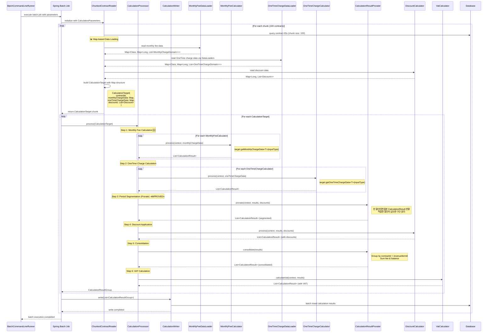

# Telecom Billing System - Batch Processing Sequence

배치 처리 과정의 전체 플로우를 시간 순서대로 보여주는 다이어그램입니다.



## 처리 단계별 상세 설명

### 🆕 데이터 로딩: Map 기반 구조
- **MonthlyFeeDataLoader**: `Map<Class<? extends MonthlyChargeDomain>, Map<Long, List<MonthlyChargeDomain>>>`
- **OneTimeChargeDataLoader**: `Map<Class<? extends OneTimeChargeDomain>, Map<Long, List<OneTimeChargeDomain>>>`
- **CalculationTarget**: 통합된 Map 기반 구조로 데이터 전달

### 1단계: 월정액 계산 (Monthly Fee) 🆕 개선
- **인터페이스 기반 처리**: `MonthlyFeeCalculator` 인터페이스 활용
- **타입 안전 접근**: `target.getMonthlyChargeData<T>(inputType)` 제네릭 메서드
- **BasicPolicyMonthlyFeeCalculator**: 기본 정책 기반 월정액 계산 구현체
- **확장성**: 새로운 MonthlyFeeCalculator 자동 처리 (`@Order` 기반)

### 2단계: 일회성 과금 계산 (OneTime Charges)
- **설치비 (Installation Fee)**: 설치 내역 기반 계산
- **단말할부금 (Device Installment)**: 월별 할부금 계산
- **타입 안전 접근**: `target.getOneTimeChargeData<T>(inputType)` 제네릭 메서드
- **확장성**: 새로운 일회성 과금 타입 자동 처리

### 3단계: 구간 분리 (Period Segmentation) ⭐ 로직 개선 ⭐
- **빈 할인 처리 개선**: 적합한 discount가 없으면 원본 CalculationResult 그대로 반환
- **데이터 무결성**: prorate 과정에서 CalculationResult 손실 방지
- **할인 기간별 분리**: 적합한 할인이 있을 때만 구간 분리 적용
- **정확한 할인 적용**: 전처리 단계에서 정밀한 구간 분리

### 4단계: 할인 적용 (Discount Application)
- **금액 할인**: 고정 금액 차감
- **비율 할인**: 요금의 일정 비율 차감
- **할인 기간 내 요금에만 적용**: 구간별 정확한 할인 적용

### 5단계: 구간 통합 (Consolidation)
- 동일한 `contractId` + `revenueItemId` 그룹화
- `fee`와 `balance` 합계 계산
- 분리된 구간들을 하나의 결과로 통합

### 6단계: VAT 계산 (VAT Calculation)
- 수익항목별 VAT 적용 여부 확인
- VAT 대상 요금에 부가세 계산
- 최종 청구 금액 확정

## 배치 성능 특성

- **청크 크기**: 100건씩 처리
- **멀티스레딩**: 설정 가능한 스레드 수
- **메모리 효율**: 청크 단위 처리로 메모리 사용량 제어
- **트랜잭션**: 청크별 독립적 트랜잭션 처리

## 확장성 및 주요 개선사항

### 🚀 확장성
- **새로운 MonthlyFeeCalculator**: `@Component` + `@Order` 등록만으로 자동 통합
- **새로운 OneTimeChargeCalculator**: `@Component` + `@Order` 등록만으로 자동 통합
- **마커 인터페이스 기반**: `MonthlyChargeDomain`, `OneTimeChargeDomain` 구현만으로 자동 처리
- **Map 기반 자동 DI**: Spring의 자동 의존성 주입 활용
- **플러그인 아키텍처**: 기존 코드 수정 없이 기능 확장

### 🆕 주요 아키텍처 개선사항

#### 1. 패턴 통일
- **MonthlyFee와 OneTimeCharge 동일 패턴**: Calculator/DataLoader 인터페이스 구조 통일
- **Map 기반 CalculationTarget**: 일관된 데이터 접근 방식
- **제네릭 메서드**: 타입 안전한 데이터 조회 (`getMonthlyChargeData<T>()`, `getOneTimeChargeData<T>()`)

#### 2. 타입 안전성 향상
- **마커 인터페이스**: 컴파일 타임 타입 검증
- **제네릭 제약**: `<T extends MonthlyChargeDomain>`, `<T extends OneTimeChargeDomain>`
- **자동 타입 추론**: Spring DI와 제네릭을 활용한 타입 안전성

#### 3. 데이터 무결성 개선
- **CalculationResultProrater**: 빈 할인시 원본 데이터 보존
- **구간 분리 로직**: 데이터 손실 없는 안전한 prorate 처리
- **Map O(1) 조회**: 성능과 안전성을 동시에 확보

#### 4. 코드 간소화
- **조건부 로직 제거**: Map 기반 처리로 if-else 문 제거
- **자동 컴포넌트 스캔**: `@Component` 기반 자동 등록
- **순수 함수형 접근**: Stream API와 함수형 프로그래밍 활용

### 💡 확장 예시

새로운 월정액 계산기 추가 시:
```java
@Component
@Order(20)
public class PremiumPolicyMonthlyFeeCalculator implements
    MonthlyFeeCalculator<PremiumContract>,
    MonthlyFeeDataLoader<PremiumContract> {
    // 구현만 하면 자동으로 처리 파이프라인에 통합
}
```

새로운 일회성 과금 추가 시:
```java
@Component
@Order(200)
public class MaintenanceFeeCalculator implements
    OneTimeChargeCalculator<MaintenanceFee>,
    OneTimeChargeDataLoader<MaintenanceFee> {
    // 구현만 하면 자동으로 처리 파이프라인에 통합
}
```

이러한 구조로 **제로 코드 변경**으로 새로운 계산 유형을 확장할 수 있습니다.