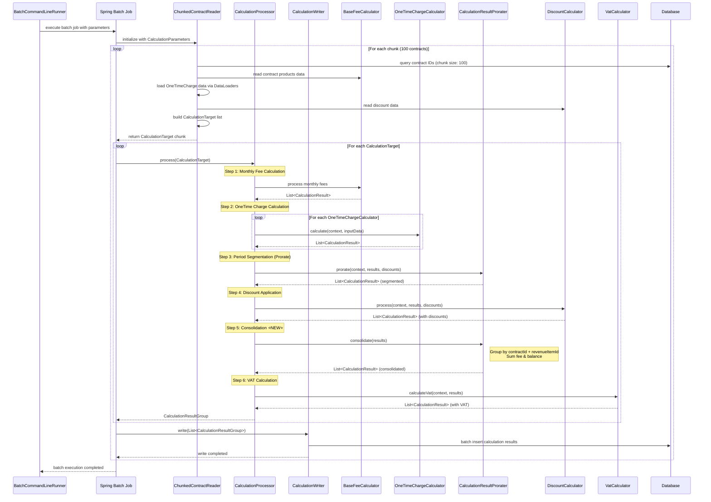

# Telecom Billing System - Batch Processing Sequence

배치 처리 과정의 전체 플로우를 시간 순서대로 보여주는 다이어그램입니다.

## 처리 단계별 상세 설명

### 1단계: 월정액 계산 (Monthly Fee)
- 계약의 상품별 월정액 계산
- 일할계산 적용 (계약 시작/종료일 고려)
- 서비스 정지 기간 고려

### 2단계: 일회성 과금 계산 (OneTime Charges)
- **설치비 (Installation Fee)**: 설치 내역 기반 계산
- **단말할부금 (Device Installment)**: 월별 할부금 계산
- **확장 가능**: 새로운 일회성 과금 타입 자동 처리

### 3단계: 구간 분리 (Period Segmentation)
- 할인 기간에 따른 청구 구간 분리
- 각 구간별 별도 CalculationResult 생성
- 정확한 할인 적용을 위한 전처리

### 4단계: 할인 적용 (Discount Application)
- **금액 할인**: 고정 금액 차감
- **비율 할인**: 요금의 일정 비율 차감
- 할인 기간 내 요금에만 적용

### 5단계: 구간 통합 (Consolidation) ⭐새로 추가⭐
- 동일한 `contractId` + `revenueItemId` 그룹화
- `fee`와 `balance` 합계 계산
- 분리된 구간들을 하나의 결과로 통합

### 6단계: VAT 계산 (VAT Calculation)
- 수익항목별 VAT 적용 여부 확인
- VAT 대상 요금에 부가세 계산
- 최종 청구 금액 확정

## 배치 성능 특성

- **청크 크기**: 100건씩 처리
- **멀티스레딩**: 설정 가능한 스레드 수
- **메모리 효율**: 청크 단위 처리로 메모리 사용량 제어
- **트랜잭션**: 청크별 독립적 트랜잭션 처리

## 확장성

- **새로운 Calculator**: `@Order` 어노테이션으로 실행 순서 제어
- **새로운 DataLoader**: `@Component` 등록만으로 자동 통합
- **플러그인 아키텍처**: 기존 코드 수정 없이 기능 확장