# OneTimeCharge 확장 구조

Spring DI를 활용한 제로 코드 확장 아키텍처를 보여주는 다이어그램입니다.

```mermaid
classDiagram
    %% OneTimeCharge 확장 가능한 구조
    class OneTimeChargeDomain {
        <<interface>>
        +getContractId() Long
    }
    
    class OneTimeChargeCalculator~T~ {
        <<interface>>
        +getInputType() Class~T~
        +calculate(CalculationContext, List~T~) List~CalculationResult~
    }
    
    class OneTimeChargeDataLoader~T~ {
        <<interface>>
        +getDataType() Class~T~
        +read(List~Long~, CalculationContext) Map
    }
    
    %% 기존 구현체들
    class InstallationHistory {
        +contractId: Long
        +installationDate: LocalDate
        +fee: BigDecimal
    }
    
    class DeviceInstallmentMaster {
        +contractId: Long
        +installmentStartDate: LocalDate
        +totalInstallmentAmount: BigDecimal
        +installmentMonths: Integer
    }
    
    class InstallationFeeCalculator {
        @Component
        @Order(23)
    }
    
    class DeviceInstallmentCalculator {
        @Component
        @Order(21)
    }
    
    %% 확장 예시 (새로운 OneTimeCharge 타입)
    class MaintenanceFee {
        <<example>>
        +contractId: Long
        +maintenanceDate: LocalDate
        +maintenanceFee: BigDecimal
    }
    
    class MaintenanceFeeCalculator {
        <<example>>
        @Component
        @Order(25)
    }
    
    class MaintenanceFeeDataLoader {
        <<example>>
        @Component
    }
    
    %% Spring DI 자동 주입 구조
    class CalculationCommandService {
        -calculatorMap: Map~Class, OneTimeChargeCalculator~
        -dataLoaderMap: Map~Class, OneTimeChargeDataLoader~
        
        Note: Spring이 자동으로 모든 @Component 
        OneTimeChargeCalculator와 DataLoader를
        Map으로 주입
    }
    
    class ChunkedContractReader {
        -oneTimeChargeDataLoaderMap: Map~Class, OneTimeChargeDataLoader~
        
        Note: 생성자에서 List를 Map으로 변환
        Function.identity() 사용
    }
    
    %% 관계
    InstallationHistory ..|> OneTimeChargeDomain
    DeviceInstallmentMaster ..|> OneTimeChargeDomain
    MaintenanceFee ..|> OneTimeChargeDomain
    
    InstallationFeeCalculator ..|> OneTimeChargeCalculator
    DeviceInstallmentCalculator ..|> OneTimeChargeCalculator
    MaintenanceFeeCalculator ..|> OneTimeChargeCalculator
    
    InstallationFeeCalculator ..|> OneTimeChargeDataLoader
    DeviceInstallmentCalculator ..|> OneTimeChargeDataLoader
    MaintenanceFeeDataLoader ..|> OneTimeChargeDataLoader
    
    CalculationCommandService --> OneTimeChargeCalculator
    CalculationCommandService --> OneTimeChargeDataLoader
    ChunkedContractReader --> OneTimeChargeDataLoader
```



## 확장 패턴

### 새로운 OneTimeCharge 타입 추가 시 (예: MaintenanceFee)

#### 1. Domain 객체 생성
```java
public record MaintenanceFee(
    Long contractId,
    LocalDate maintenanceDate, 
    BigDecimal maintenanceFee
) implements OneTimeChargeDomain {
    @Override
    public Long getContractId() {
        return contractId;
    }
}
```

#### 2. DataLoader 생성
```java
@Component
public class MaintenanceFeeDataLoader implements OneTimeChargeDataLoader<MaintenanceFee> {
    
    @Override
    public Class<MaintenanceFee> getDataType() {
        return MaintenanceFee.class;
    }
    
    @Override
    public Map<Long, List<OneTimeChargeDomain>> read(List<Long> contractIds, CalculationContext ctx) {
        // 데이터 로딩 로직
    }
}
```

#### 3. Calculator 생성
```java
@Component
@Order(25) // 실행 순서 지정
public class MaintenanceFeeCalculator implements OneTimeChargeCalculator<MaintenanceFee> {
    
    @Override
    public Class<MaintenanceFee> getInputType() {
        return MaintenanceFee.class;
    }
    
    @Override
    public List<CalculationResult<?>> calculate(CalculationContext context, List<MaintenanceFee> inputs) {
        // 계산 로직
    }
}
```

## 아키텍처 장점

### 1. 제로 코드 확장성
- 새로운 OneTimeCharge 타입 추가 시 기존 코드 수정 불필요
- Spring의 `@Component` 스캐닝만으로 자동 통합

### 2. 타입 안전성
- 마커 인터페이스 (`OneTimeChargeDomain`)로 컴파일 타임 타입 검증
- 제네릭 타입 매개변수로 타입 불일치 방지

### 3. Spring DI 활용
```java
// List 자동 주입 후 Map 변환
public CalculationCommandService(
    List<OneTimeChargeCalculator<? extends OneTimeChargeDomain>> calculators,
    List<OneTimeChargeDataLoader<? extends OneTimeChargeDomain>> dataLoaders) {
    
    this.calculatorMap = calculators.stream()
        .collect(Collectors.toMap(
            OneTimeChargeCalculator::getInputType,
            Function.identity()
        ));
    
    this.dataLoaderMap = dataLoaders.stream()
        .collect(Collectors.toMap(
            OneTimeChargeDataLoader::getDataType,
            Function.identity()
        ));
}
```

### 4. 실행 순서 제어
- `@Order` 어노테이션으로 Calculator 실행 순서 제어
- Spring의 표준 방식 활용

### 5. 조건문 완전 제거
```java
// 기존 방식 (조건문 필요)
if (data instanceof InstallationHistory) {
    // 설치비 처리
} else if (data instanceof DeviceInstallmentMaster) {
    // 할부금 처리
}

// 새로운 방식 (Map 기반 자동 처리)
for (var entry : calculatorMap.entrySet()) {
    var calculator = entry.getValue();
    var data = target.getOneTimeChargeData(entry.getKey());
    calculator.calculate(context, data);
}
```

## 성능 최적화

### Map 기반 O(1) 조회
- 타입별 Calculator/DataLoader를 Map으로 관리
- if-else 체인 대신 상수 시간 조회

### 타입 안전한 캐스팅
- `@SuppressWarnings("unchecked")` 최소화
- 제네릭 타입 시스템 활용으로 런타임 안전성 확보